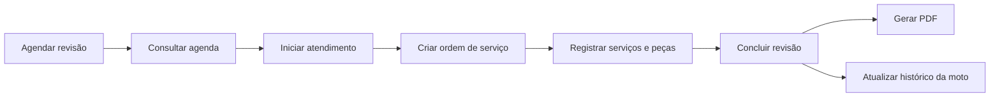
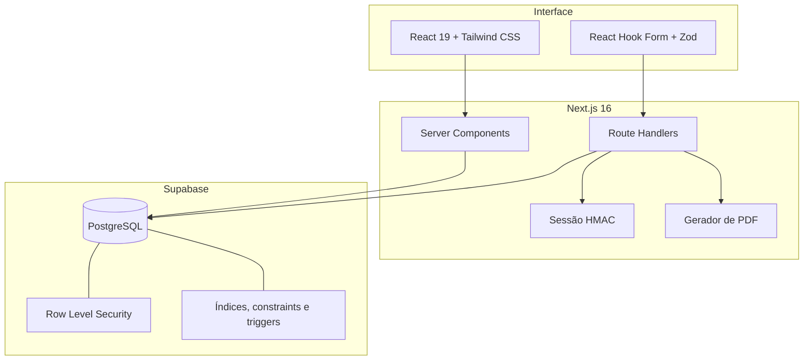
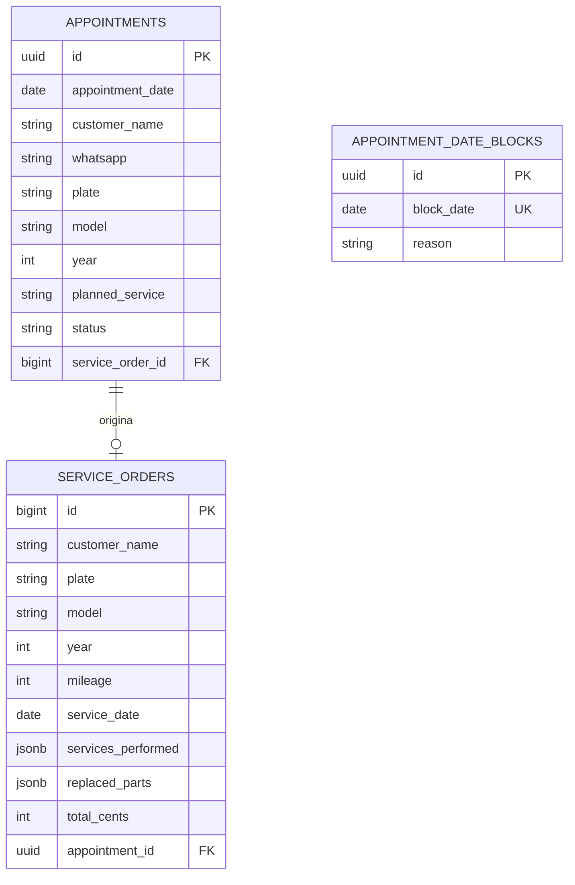

<div align="center">
  <picture>
    <source media="(prefers-color-scheme: dark)" srcset="./public/moto-os-identidade-completa/brand/moto-os-logo-white.svg">
    <source media="(prefers-color-scheme: light)" srcset="./public/moto-os-identidade-completa/brand/moto-os-logo-dark.svg">
    
  </picture>

  <br><br>

  **Gestão de oficina de motocicletas, do agendamento ao histórico de manutenção.**

  <br>

  [](https://nextjs.org/)
  [](https://react.dev/)
  [](https://www.typescriptlang.org/)
  [](https://supabase.com/)
  [](https://tailwindcss.com/)

  <br>

  [Funcionalidades](#funcionalidades) · [Arquitetura](#arquitetura) · [Como executar](#como-executar) · [Deploy](#deploy) · [Roadmap](#roadmap)
</div>

---

## Sobre o projeto

O **Moto OS** é uma aplicação web para organizar a rotina de uma oficina de motocicletas. A plataforma centraliza ordens de serviço, dados dos clientes, histórico dos veículos e agenda de revisões em uma interface responsiva com identidade visual inspirada no universo motociclístico.

Este projeto nasceu como uma solução de portfólio com foco em um problema real: substituir anotações dispersas e processos manuais por um fluxo simples, seguro e rastreável. A proposta é acompanhar todo o atendimento — do agendamento da revisão até a emissão da ordem de serviço em PDF.

### O problema que ele resolve

- Evita a perda do histórico de serviços de cada motocicleta.
- Reduz conflitos de agenda ao permitir apenas uma revisão ativa por dia.
- Reaproveita os dados do último atendimento e diminui o retrabalho no cadastro.
- Reúne agenda, clientes, motocicletas e ordens de serviço em um único painel.
- Gera um documento em PDF que pode ser entregue ao cliente.

## Principais fluxos



## Funcionalidades

### Dashboard operacional

- Resumo das revisões agendadas e concluídas no mês.
- Destaque para o próximo atendimento da oficina.
- Indicação das próximas datas disponíveis.
- Acesso rápido à criação de uma ordem de serviço.
- Lista dos serviços mais recentes.

### Ordens de serviço

- Cadastro de cliente, WhatsApp, placa, modelo, ano e quilometragem.
- Registro de serviços executados e peças substituídas.
- Cálculo e armazenamento do valor total em centavos, evitando erros de ponto flutuante.
- Consulta, edição e exclusão de ordens existentes.
- Geração de ordem de serviço em PDF.
- Preenchimento automático a partir de um agendamento.

### Agenda de revisões

- Visualização mensal dos atendimentos.
- Criação de agendamentos com serviço planejado e observações.
- Bloqueio manual de datas indisponíveis.
- Estados de atendimento: agendado, concluído, cancelado e não compareceu.
- Proteção contra conflito entre uma data bloqueada e uma revisão agendada.
- Regra de uma revisão ativa por dia, garantida também no banco de dados.

### Histórico de motocicletas

- Busca por placa, modelo ou ano.
- Visualização cronológica das manutenções.
- Página dedicada para os dados e serviços de cada motocicleta.
- Aproveitamento dos dados do último atendimento em novas ordens.

### Autenticação e segurança

- Área administrativa protegida por login.
- Sessão assinada com HMAC SHA-256, válida por 12 horas.
- Cookies `httpOnly`, `sameSite=lax` e `secure` em produção.
- Comparação de credenciais em tempo constante.
- Validação dos dados com Zod no servidor.
- Row Level Security habilitado nas tabelas do Supabase.
- Chave `service_role` utilizada somente no servidor e nunca exposta ao navegador.

## Identidade visual

<div align="center">
  
  &nbsp;&nbsp;&nbsp;&nbsp;
  
</div>

O design utiliza uma base escura, alto contraste e o vermelho como cor de ação. A interface foi construída para funcionar tanto no computador da oficina quanto em telas menores, com navegação lateral no desktop e menu adaptado para dispositivos móveis.

## Arquitetura



### Modelo de dados



## Tecnologias

| Camada | Tecnologia | Responsabilidade |
| --- | --- | --- |
| Framework | Next.js 16 | Server Components, páginas e API Routes |
| Interface | React 19 + Tailwind CSS 4 | Componentes e layout responsivo |
| Linguagem | TypeScript 5 | Tipagem estática em toda a aplicação |
| Formulários | React Hook Form + Zod | Estado, máscaras e validação |
| Banco de dados | Supabase + PostgreSQL | Persistência, constraints e RLS |
| PDF | pdf-lib | Geração das ordens de serviço |
| Datas | date-fns | Manipulação e formatação de datas |
| Ícones | Lucide React | Iconografia da interface |
| Feedback | Sonner | Notificações de sucesso e erro |
| Deploy | Vercel | Hospedagem da aplicação Next.js |

## Estrutura do projeto

```text
Moto-OS/
├── app/                    # Páginas, layouts e Route Handlers
│   ├── api/                # Autenticação, agenda e ordens de serviço
│   ├── agenda/             # Calendário de revisões
│   ├── dashboard/          # Visão geral da oficina
│   ├── historico/          # Busca e histórico de manutenção
│   ├── moto/               # Detalhes de cada motocicleta
│   └── os/                 # Criação, edição e detalhes das OS
├── components/             # Componentes de domínio, formulários e UI
├── config/                 # Dados e horário de funcionamento da oficina
├── lib/                    # Autenticação, acesso a dados e validações
├── public/                 # Marca, ícones e arquivos públicos
├── supabase/migrations/    # Schema SQL versionado
└── types/                  # Tipos compartilhados do domínio
```

## Como executar

### Pré-requisitos

- [Node.js](https://nodejs.org/) 22.13 ou superior.
- Uma conta e um projeto no [Supabase](https://supabase.com/).
- Git instalado na máquina.

### 1. Clone e instale as dependências

```bash
git clone <URL-DO-SEU-REPOSITORIO>
cd Moto-OS
npm install
```

### 2. Prepare o banco de dados

No painel do Supabase, abra o **SQL Editor** e execute o arquivo:

```text
supabase/migrations/20261007000000_initial_schema.sql
```

A migração cria as tabelas `service_orders`, `appointments` e `appointment_date_blocks`, além dos índices, relacionamentos, gatilhos de integridade e políticas de segurança necessárias.

### 3. Configure o ambiente

Copie o arquivo de exemplo:

```bash
cp .env.example .env.local
```

No Windows PowerShell, você também pode usar:

```powershell
Copy-Item .env.example .env.local
```

Preencha as variáveis em `.env.local`:

| Variável | Descrição |
| --- | --- |
| `ADMIN_USER` | Usuário do acesso administrativo |
| `ADMIN_PASSWORD` | Senha forte do administrador |
| `SESSION_SECRET` | Segredo aleatório com no mínimo 32 caracteres |
| `SUPABASE_URL` | URL do projeto Supabase |
| `SUPABASE_SERVICE_ROLE_KEY` | Chave privada `service_role` usada no servidor |

Para gerar um segredo de sessão:

```bash
openssl rand -base64 48
```

> [!CAUTION]
> Nunca publique o arquivo `.env.local`, nunca use o prefixo `NEXT_PUBLIC_` na `SUPABASE_SERVICE_ROLE_KEY` e nunca exponha essa chave no navegador.

### 4. Inicie a aplicação

```bash
npm run dev
```

Acesse [http://localhost:3000](http://localhost:3000) e entre com o usuário definido nas variáveis de ambiente.

## Scripts disponíveis

| Comando | Descrição |
| --- | --- |
| `npm run dev` | Inicia o servidor de desenvolvimento |
| `npm run build` | Gera a versão de produção com Webpack |
| `npm run start` | Executa a versão de produção |
| `npm run lint` | Analisa o projeto com ESLint |

## Deploy

O projeto está preparado para deploy na Vercel:

1. Importe o repositório como um novo projeto Next.js.
2. Cadastre as cinco variáveis de ambiente em **Settings → Environment Variables**.
3. Selecione os ambientes de Production, Preview e Development necessários.
4. Confirme que a migração foi aplicada no projeto indicado em `SUPABASE_URL`.
5. Faça o deploy mantendo os comandos padrão de instalação e build.

O build não precisa acessar o banco; a conexão com o Supabase ocorre em tempo de execução.

## Decisões técnicas

- **Valores monetários em centavos:** evita imprecisões de números decimais.
- **Regras críticas no PostgreSQL:** conflitos de agenda são impedidos mesmo fora da interface.
- **Acesso ao banco pelo servidor:** reduz a superfície de exposição das credenciais e dos dados.
- **Server Components para leitura:** diminui JavaScript no cliente e mantém o acesso aos dados no backend.
- **Tipos de domínio compartilhados:** mantém formulários, APIs e persistência alinhados.
- **Identidade visual versionada:** logos, ícones e manifesto ficam junto do código da aplicação.

## Roadmap

- [ ] Cadastro independente de clientes e motocicletas.
- [ ] Controle de estoque de peças e alertas de reposição.
- [ ] Perfis de acesso para administrador e mecânicos.
- [ ] Envio da ordem de serviço por WhatsApp.
- [ ] Relatórios de faturamento, serviços e peças mais utilizados.
- [ ] Testes automatizados de unidade, integração e ponta a ponta.
- [ ] Auditoria das alterações realizadas nas ordens de serviço.
- [ ] PWA com experiência otimizada para uso na oficina.

## Status

O Moto OS está em desenvolvimento ativo e será colocado em prática em uma oficina. A base funcional já cobre autenticação, agenda, ordens de serviço, histórico e geração de PDF; os próximos ciclos serão guiados pelo uso real e pelo feedback da operação.

## Autor

Desenvolvido como projeto de portfólio e solução prática para gestão de oficinas de motocicletas.

Se este projeto foi útil ou despertou alguma ideia, deixe uma estrela no repositório. 🏍️
